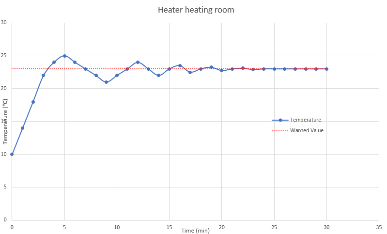

PID Control
===========

PID
  Proportional, Integral, Derivative feedback loop

Gain
  Amount of output given from each of the components of PID.

Feedforward
  A known value supplied to the output as a guesstimate so the PID only has to make minor corrections.

PID Control lies at the heart of any advanced robotics motion. Essentially, it is a way of controlling something, i.e. a wheel or an arm, using information gathered by the surroundings, In robotics, data is usually gathered through sensors, like encoders, range sensors, light sensors, etc. Using this data, robots can determine how they should act.

Let's say you have a cold room, like 10 degrees. You want to warm it up to a nice 23 degrees (celsius). Luckily you have a heater. You set it's thermostat to 23, and it starts heating. It heats as fast as it can, and quickly gets to 23 degrees. It immediatly turns off. However, the coils on the heater are still warm, and continue to heat the air for a while after. The room heats up to 25, before the coils cool down, and the room loses heat to the environment. It dips down to 23 degrees, and the heater turns on - but it takes time for the coils to turn on, and during this time the room cools down to 21 degrees. This oscilliation around the set point slowly dies out, over a long period of time.

PID is designed to intelligently approach the target to reach it as quickly as possible. So in this example, the heater would have turned off before it hit 23, say at 21 degrees, such that it natrually warms up to 23.

In robotics, the same concept can be applied. Many teams use PID control to drive during autonomous, using encoders as their sensor, shooting, using cameras as their sensor, or rotating, using gyros as their sensor.

The main equation for PID Control is

   :math:`output = P \times error + I \times \sum error + D \times \frac{\delta error}{\delta t}`

Proportional
------------

:math:`P \times error`

Proportional control is using a predetermined constant (``kP``)to control how much a mechanism can move. Every time the PID code is run, the error is calculated, and the proportional gain is multiplied to this. In the car analogy, lets say the pressure you were applying was inversely proportional to the distance you were from the stop sign. ``P = 1/(error^2)`` and ``error`` is distance from the stop sign. (Note, P is 1/error^2 because you want the output to be 1/error.)

========  ======
Distance  Output
========  ======
200        .005
150        .0067
100        .001
50         .02
10         .1
1          1
========  ======

Using this P value, we apply more pressure the closer we get, causing us to slow down.

Using only Proportional control can be done, and is usually better for slow moving mechanisms, or mechanisms where you don't need com

Integral
--------

:math:`I \times \sum error`

When controlling a motor with just P, you may find that it oscillates. This happens because it has too much power when it gets to the setpoint, and it overshoots. Then when it tries to correct, it overshoots again, and this cycle continues. One way to reduce this is to lower :math:`P`. This could have some bad side effects though. By reducing :math:`P`, your motor may not get *all* the way to where you want it to. It may be off by a few degrees or rotations. To overcome this **steady-state** error, an Integral gain is introduced.

If you've taken calculus, you know the integral is the area under a curve or line. It's the same with PID. The Integral gain is the sum of all the past error. This means the gain will increase more and more the longer the motor isn't where it's supposed to be.

Even though this reduces steady state error, it may increase settling time. If you notice it oscillating a little bit before settling, you may need a Derivate gain.

Derivative
----------
:math:`D \times \frac{\delta error}{\delta t}`

Derivative gain works by calculating the change in error. By finding this change, it can predict future system behavior, and reduce settling time. It does this by applying a brake more or less. This can be useful if it is imperative that you don't overshoot. This isn't even used in the industry much, but if you find yourself with long settling times, it may help to introduce a Derivative gain.

Tuning Methods
--------------

Zeigler-Nichols
^^^^^^^^^^^^^^^

Zeigler-Nichols tuning method works by increasing ``P`` until the system starts oscillating, and then using the period of the oscillation to calculate ``I`` and ``D``.

#. Start by setting ``I`` and ``D`` to 0.
#. Increase ``P`` until the system starts oscillating for a period of ``Tu``.  You want the oscillation to be large enough that you can time it. This maximum ``P`` will be referred to as ``Ku``.
#. Use the chart below to calculate different ``P``, ``I``, and ``D`` values.

============= ====== ========= ==========
Control Types P      I         D
============= ====== ========= ==========
P             .5*Ku    \-       \-
PI            .45*Ku .54*Ku/Tu  \-
PID            .6*Ku 1.2*Ku/Tu 3*Ku*Tu/40
============= ====== ========= ==========

.. note::
    The period of oscillation is one full 'stroke', there and back. Imagine a grandfather clock with a pendulum, when it is all the way to the right, swings to the left, and hits the right again, that is 1 period.

Which ones to use
-----------------
P control is best used on slow moving parts that aren't subject to overshooting, or parts of the robot that don't need complete accuracy. Turning to a certain degree, for example, can be done with just P in some cases (but not all).

The most common control loop is PI. It combines simple P control with the fine tuning feature of an Integral gain. This is teams are most likely to use.

Complete PID may be overkill for an FRC robot, but if you find that PI isn't working *enough*, feel free to add D gain
