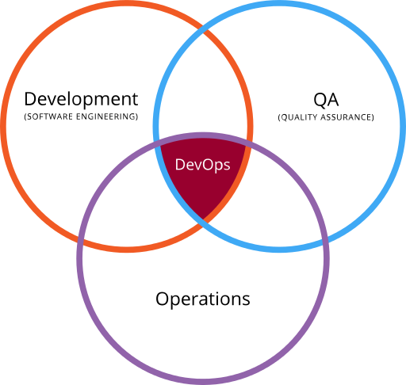
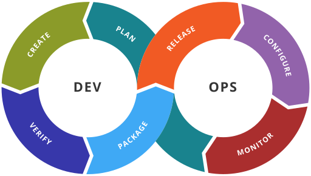

**********************
Introduction to DevOps
**********************

Most people who come this guide will have heard about it from a friend. They
normally need help with some component in their code, or want to know how to use
a specific sensor.

Some of you come here to learn to code to begin with. These people have a long
road ahead of them, and I encourage them to keep going.

Some of you are here because you wish to learn to code better. For you, this is
the wrong chapter, but I will point you to my section on `Code Design and Architecture`_.

And lastly, some of you here are Software leads or Mentors, some of whom are on
either new teams, or thinking their workflows can be optimized for their sub-
team.
This guide is built for these people. The people who wish to improve
development workflow, to better their build systems, and to clean up their codebase,
and to make their lives as maintainers *much* easier.

DevOps
------
First we must establish the obvious, **DevOps** is a "clipped compound" of the
words ***development*** and ***operations***. DevOps is a blanket term that encompasses many aspects of the software development cycle.
As you can see in **Figure 1**. It is often described as the combination of many aspects of
development, quality assurence, and general operations.

        **Figure 1**

        A Venn Diagram showing the crossing between *development*, *QA*, and *Operations*,
        as "DevOps".

        Image by `Rajiv.Pant <https://commons.wikimedia.org/w/index.php?title=User:Rajiv.Pant&action=edit&redlink=1>`_,
        derieved from `Wylve <https://commons.wikimedia.org/wiki/User:Wylve>`_ /
        `CC BY 3.0 <http://creativecommons.org/licenses/by/3.0>`_

DevOps Toolchains
^^^^^^^^^^^^^^^^^

A "toolchain", is really a set of tools intended for use with DevOps. These
tools cover a wide array of uses, as DevOps is such an encompassing field.
Tools typically fall into a few different catagories, as can be seen below in
**Figure 2**. For a quick breakdown of the DevOps "toolchain" flow, see **Figure 3**.

    .. topic:: Plan

            The planning phase is  pretty straight forward, but this is where
            much time will be spent. Planning is a key step in the design process,
            and should not be downplayed.

    .. topic:: Create

            This is the beginning development phase; where you and your team begin
            code synthesis. This is often regarded as the most important part,
            but as we see later, it is merely a small part in the bigger picture.

    .. topic:: Verify/Test

            One of the ***most*** important, yet most annoying phases of the entire
            development process, is insuring the code does what it is supposed to do.
            This can be accomplished in a variety of ways, but the way it is
            typically handled, is by designing through `Test Driven Design`.

    .. topic:: Package

            Pre-deployment phase. After you pass the tests, you must have your
            code ready to ship, or in our case, deploy to our robot at the end
            of build season. This is normally the last phase that many developers
            will stop at.

    .. topic:: Release

            This phase seems pretty simple, but it isn't as small as it seems.
            This isn't just the merge into master that we've all been waiting
            6 weeks for, no. This is where we finalize the code is ready,
            re-run the tests until we feel comfortable, and then finally push
            to the RoboRIO.

    .. topic:: Configuration

            This step is also pretty obvious in our case. Tuning your teams robot,
            calibrating sensors, and ensuring the code will be able to run to its
            full potential by ensuring our vessel is functional.

    .. topic:: Monitor

            This phase is where all the improvements happen in your code. This is
            when your robot is out there preforming, kicking butt, or perhaps breaking
            for some of us. This is the time where you watch, make notes of what happened,
            and prepare to begin this cycle all over again with planning, so as to
            preserve the good development cycle you have built up, as well as fixing
            the issues that exist in your code currently.

**Figure 2**

A listing of the various stages of the DevOps "toolchain" flow, and a short
description of each phase.

        **Figure 3**

        Illustration showing the stages in a DevOps "toolchain", which we will touch on later.

        Image by `Kharnagy <https://commons.wikimedia.org/w/index.php?title=User:Kharnagy&action=edit&redlink=1>`_ /
        `CC BY-SA 4.0 <http://creativecommons.org/licenses/by-sa/4.0>`_

.. topic:: Whats to Come
In the following sections, we will break down the each of these aspects into
their own section. What it is, how it effects your development, costs, both
in terms of money and time, its worth, and tools for the job. For some other topics,
we will break it down even further. There will be sections about Git and
Version Control Systems (we will just use VCS or Git to refer to these),
Continuous Integration and its applications, as well as many more.

Below is a Table of Contents, providing links to all of the relevent pages.
I hope you enjoy the reading, and that this knowledge may help your team both now,
and in the future in your careers.

.. toctree::
    :maxdepth: 2
    :caption: Phases
    :glob:

    phases/*
