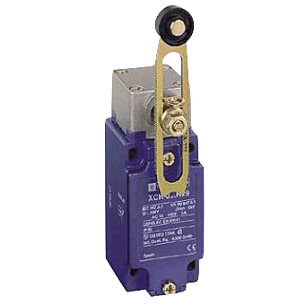

==============
Limit Switches
==============

Limit Switches are sensors that tell you when a component is touching it or not. They can be used to prevent mechanisms from moving too far in one direction or another, or - if placed on the outside of the robot - if you've hit something. They do this by sending a signal to the motor controller or roboRIO reporting it has gone the maximum distance.

There is nothing special about a limit switch that makes it a limit switch. Any type of switch will do, as long as it can reset itself when nothing is touching it (e.g. a light switch wouldn't work well as a limit switch since it doesn't automatically flip one way or another). Commonly used as limit switches are microswitches, since they have settings for Normally Open and Normally Closed, however, their small size makes them prone to breaking easily. They also require the mechanism to contact it head on, which can cause for awkward placement in a rotating object such as an arm. For these more advanced mechanisms, industrial limit switches might be useful because they can work with many different motions.

    |switch1| |switch2|

.. |switch1| image:: media/limitswitch.png
    :width: 48%

Wiring a Limit Switch
---------------------
Limit switches generally need two wires. One for ground, and one for signal. On the limit switch, you will generally see 3 connectors. Normally Open (NO), Normally Closed (NC) (see above left for examples of labeling), and ground. Normally Open means the switch is normally in the unpressed/untriggered position. When something depresses the switch, it will send a signal back to the roborio/motor controller saying it has been tripped. Normally Closed is the opposite. Connect the white/yellow wire of a PWM cable to either `NO` or `NC`, depending on the application, and the black/brown wire to ground.

Industrial limit switches sometimes have 4 contacts. 2 `NO` and 2 `NC` to allow for multi-directional limiting, i.e. clockwise vs counterclockwise. Make sure to wire the correct side or your switch may not be tripped.

RoboRIO
^^^^^^^

To wire a limit switch to the roborio, you can use normal PWM cable. You can solder the wire directly to the limit switch, however certain connectors such as `these andymark connectors <http://www.andymark.com/product-p/am-2212.htm>`_ should allow you to make a quick-connect wire. I recommend soldering because the small wires are hard to get a good crimp with, and connectors can become unplugged, but I recommend connectors as well because you can unplug them if you need to change something.

Once you create the wire, connect it to the correct port on the switch (NC or NO). The other end of the switch should go to a DIO, or Digital In/Out port on the roborio.

Talon SRX
^^^^^^^^^
The easiest way to connect a limit switch to a TalonSRX is through the `breakout board <http://www.ctr-electronics.com/talon-srx-encoder-breakout-board.html>`_. Linked is the encoder breakout board, but the analog breakout board will work as well. Theoretically you could solder directly to the SRX pin but it is not recommended.

If you don't want to buy the breakout board, you can use the roboRIO method. Connecting directly to the SRX is recommended because it interacts at the hardware level, and will respond faster.

Spark
^^^^^
The spark is the easiest to connect a limit switch to, since there is no soldering and the PWM cable can plug direcly into it. Connect the clipped end of the PWM cable to the limit switch, then plug the end with the housing still intact into the spark with the ground on the outside.

Programming a Limit Switch
--------------------------
Determining the status of the limit switch can be determined using the ``get`` method of ``DigitalInput``. Using them to control motor behavior is a bit harder. Your first instinct may be to call ``get`` on the limit switch, and if ``get`` returns ``true``, set the motor to 0. This is... *not* going to work, unless you want the motor to be disabled for the rest of the game. When the limit switch is enabled, you need to limit motor speed **only in that direction** or else you can't reverse the motor. We can do this with a simple min/max function.

.. tabs::

    .. code-tab:: java

        public class MyRobot extends IterativeRobot{
            public void robotInit(){
                DigitalInput forwardLimitSwitch = new DigitalInput(1);
                DigitalInput reverseLimitSwitch = new DigitalInput(2);
                Talon motor = new Talon(1);
                Joystick joystick1 = new Joystick(1);
            }

            public void teleopPeriodic()
            {
                int output = joystick1.getY(); //Moves the joystick based on Y value
                if (forwardLimitSwitch.get()) // If the forward limit switch is pressed, we want to keep the values between -1 and 0
                    output = Math.min(output, 0);
                else if(reverseLimitSwitch.get()) // If the reversed limit switch is pressed, we want to keep the values between 0 and 1
                    output = Math.max(output, 0);
                motor.set(output);
            }
        }
    .. code-tab:: c++

        #include <math.h>

        class Robot: public IterativeRobot
        {
            DigitalInput forwardLimitSwitch, reverseLimitSwitch;
            Joystick joystick1;
            Talon motor;

        public:
            Robot() {

            }

            void RobotInit(){
                forwardLimitSwitch = new DigitalInput(1);
                reverseLimitSwitch = new DigitalInput(2);
                joystick = new Joystick(1);
                motor = new Talon(1);
            }

            void teleopPeriodic() {
                int output = joystick1->getY(); //Moves the joystick based on Y value
                if (forwardLimitSwitch->get()) // If the forward limit switch is pressed, we want to keep the values between -1 and 0
                    output = fmin(output, 0);
                else if(reverseLimitSwitch->get()) // If the reversed limit switch is pressed, we want to keep the values between 0 and 1
                    output = fmax(output, 0);
                motor->set(output);
            }
    .. code-tab:: py

        class MyRobot(wpilib.IterativeRobot):

            def robotInit(self):
                self.forwardLimitSwitch = wpilib.DigitalInput(1)
                self.reverseLimitSwitch = wpilib.DigitalInput(2)
                self.joystick1 = wpilib.Joystick(1)
                self.motor = wpilib.Talon(1)

            def teleopPeriodic(self):
                output = self.Joystick1.getY()
                if self.forwardLimitSwitch.get():
                    output = min(0, output)
                elif self.reverseLimitSwitch.get():
                    output = max(0, output)

                motor.set(output)
