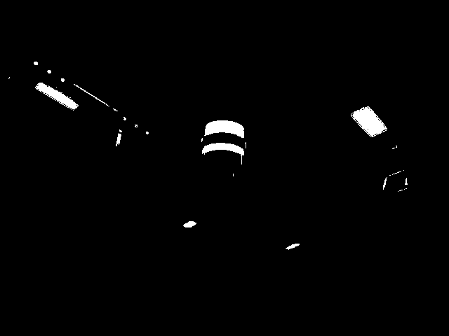
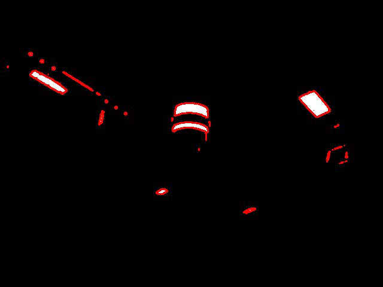
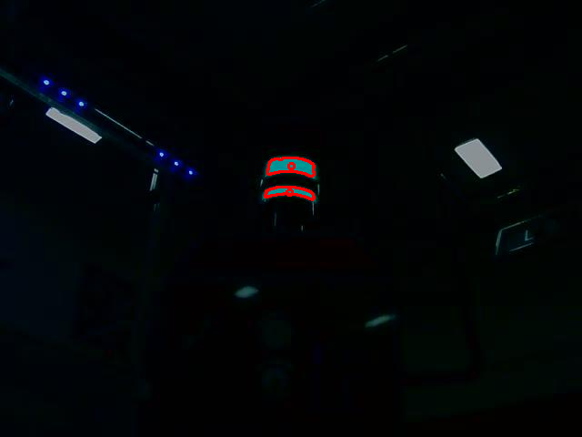

.. _Contour_Features:

Contour Features
================

By this time, you should have an image that looks like this

.. figure:: ../vision/media/boilerthresh.png
    :width: 320px
    :align: center
    :height: 240px
    :alt: Binary Image
    :figclass: align-center

but in all reality, your image probably looks something like this

We recommend you use "findcontours" for your edge detector. It is a rather old algorithm, but it is very effective as well as fast. Here is code that calls findcontours and draws them onto an image. Make sure that the image you are drawing to is RGB and not GrayScale if you want to draw things in color.

.. tabs::

   .. code-tab:: java

	List<MatOfPoint> contours = new ArrayList<MatOfPoint>();
	Mat hierarchy = new Mat();
        Imgproc.findContours(img, contours, hierarchy, Imgproc.RETR_EXTERNAL, Imgproc.CHAIN_APPROX_NONE);
	for (int i = 0; i < contours.size(); i++) {
    		//...contour code here...
	}

   .. code-tab:: c++

        vector<vector<Point> > contours;
        vector<Vec4i> hierarchy;
        findContours(img, contours, hierarchy, CV_RETR_EXTERNAL, CV_CHAIN_APPROX_NONE, Point(0, 0));
        for (size_t i = 0; i < contours.size(); i++)
        {
		drawContours(draw, contours, i, Scalar(255, 0, 255), 3, 8, hierarchy, 0, Point() );
	}

   .. code-tab:: py

	img2, contours, hierarchy = cv2.findContours(img,cv2.RETR_TREE,cv2.CHAIN_APPROX_NONE)
	for contour in contours:
	    cv2.drawContours(draw, [contour], 0, (255, 0, 255), 3)

CHAIN_APPROX_NONE is a flag that tells findContours to store every contour point - including contours inside other contours, or multiple along the same line. If you don't have the strongest of computers (like a Pi), I recommend using CHAIN_APPROX_SIMPLE because it compresses horizontal, vertical, and diagonal segments and leaves only their end points.

Moving forward, this is where you must get creative. If you have contours that are not wanted, you must come up with tests that will pass on the contours that you want, but fail on the ones you do not wish to keep.

An implementation note: The following tests are meant to be implemented in a for loop, where the programmer is looping through every contour.

.. tabs::

   .. code-tab:: java

        for(int i = 0; i < contours.size(); i++ )
	{
	    //contours.get(i)....
	}

   .. code-tab:: c++

        vector<vector<Point> > contours;

        for (size_t i = 0; i < contours.size(); i++)
        {
	    //contours[i] ....
        }

   .. code-tab:: py

       for contour in contours:
           # do stuff with contour....

Contour Area
------------

A quick and easy way to filter out small contours is to check their area. Establish a minimum and maximum area, which will probably have to be found empirically, and check to see if the contour's area falls within that range.

.. tabs::

   .. code-tab:: java

        double contourArea = Imgproc.contourArea(contour);
	if(contourArea < min_area || contourArea > maxArea)
        {
            continue;
        }

   .. code-tab:: c++

       float contourArea = contourArea(contours[i]);
       if contourArea > maxArea || contourArea < minArea)
       {
           continue;
       }

   .. code-tab:: py

       contourArea = cv2.contourArea(contour)
       if contourArea < minArea or contourArea > maxArea:
           continue

For code readability, I prefer to do that continue approach when looping through contours, instead of nested every contour test. It makes the code more readable, as well makes the programmer have to worry about counting an absurd amount of curly brackets.

Aspect Ratio
------------

Aspect Ratio refers to the ratio between the contour's width / contour's height. To do this, one could find the extreme points, but it is easier to apply a bounding rectangle and then compute the ratio of the bounded rectangle.

.. tabs::

   .. code-tab:: java

         Rect boundRect = Imgproc.boundingRect(contour);
         float ratio = (float)boundRect.width/boundRect.height

   .. code-tab:: c++

         Rect boundRect = boundingRect(contours[i]);
	 float ratio = (float)boundRect.width/boundRect.height

   .. code-tab:: py

         x,y,w,h = cv2.boundingRect(contour)
         ratio = float(w)/h

Remember to cast to float, otherwise integer division will occur and you won't get precise ratios.

Solidity
--------

The last test we will cover is solidity. That is, the ratio between the contour area and the bounding rectangle area. This is useful to determine the "rectangle-ness" of the contour. The more closely the bounding rectangle fits the contours, the closer this ratio will be to 1.

.. tabs::

   .. code-tab:: java

         Rect boundRect = Imgproc.boundingRect(contour);
         float ratio = Imgproc.contourArea(contour)/(boundRect.width*boundRect.height)

   .. code-tab:: c++

         Rect boundRect = boundingRect(contours[i]);
	 float ratio = contourArea(contours[i])/(boundRect.width*boundRect.height);

   .. code-tab:: py

         x,y,w,h = cv2.boundingRect(contour)
         ratio = cv2.contourArea(contour)/(w*h)

Finding the center
------------------

In typical FRC fashion, you want your robot to line up with the center of the target (contour). In order to do this, one must first find the center. While you could simply apply a bounded rectangle and then find the center of that, there is a more precise way: N-th order moments.

Mathematically, a moment is defined as :math:`\mu _{n}=\int _{-\infty }^{\infty }(x-c)^{n}\,f(x)\,dx`. For a 2D continuous function f(x,y) the moment of order (p + q) is defined as :math:`M_{{pq}}=\int \limits _{{-\infty }}^{{\infty }}\int \limits _{{-\infty }}^{{\infty }}x^{p}y^{q}f(x,y)\,dx\,dy`. The area of a contour is the zeroth moment, and moments can be used to find the centroid of a contour.

.. tabs::

   .. code-tab:: java

         Rect boundRect = Imgproc.boundingRect(contour);
         float ratio = Imgproc.contourArea(contour)/(boundRect.width*boundRect.height)

   .. code-tab:: c++

         Rect boundRect = boundingRect(contours[i]);
	 float ratio = contourArea(contours[i])/(boundRect.width*boundRect.height);

   .. code-tab:: py

         x,y,w,h = cv2.boundingRect(contour)
         ratio = cv2.contourArea(contour)/(w*h)

Note that in previous years for FRC, there hasn't been a vision challenge where the vision assistance tape wasn't symmetrical. But in future if the tape isn't symmetrical, you would need to consider whether the centroid is what you desire.

Drawing
-------

A very useful function is drawing the contours on your images. While you can draw every contour using the -1 flag, instead of the contour index, it is recommended you only draw the contours that pass all your tests. This allows for fast and effective debugging.

.. tabs::

   .. code-tab:: java

	for (int i = 0; i < contours.size(); i++)
        {
            //Tests....
    	    Imgproc.drawContours(contourImg, contours, i, new Scalar(255, 255, 255), -1);
	}

   .. code-tab:: c++

        for (size_t i = 0; i < contours.size(); i++)
        {
	    //Tests...
	    drawContours(draw, contours, i, Scalar(255, 0, 255), 3, 8, hierarchy, 0, Point() );
	}

   .. code-tab:: py

	for contour in contours:
            #Tests...
	    cv2.drawContours(draw, [contour], 0, (255, 0, 255), 3)

Putting it all together
-----------------------

While other contour tests can be done, such as approximating a polygon around a contour, this a a good basis that should allow you to solve just about every FRC computer vision challenge. Here is a quick rundown of the tests needed to successfully solve the vision challenges over the years:

+--------+-------------+
| Year   | Tests       |
+========+=============+
| 2012   | Area,       |
|        | Solidity    |
+--------+-------------+
| 2013   | Area,       |
|        | Solidity,   |
|        | Aspect Ratio|
+--------+-------------+
| 2014   | Area,       |
|        | Solidity    |
+--------+-------------+
| 2015   | Area,       |
|        | Solidity    |
+--------+-------------+
| 2016   | Area,       |
|        | Solidity    |
+--------+-------------+
| 2017   | Area,       |
|        | Solidity    |
+--------+-------------+

As you can see, nearly every FRC vision challenge can be solved with a simple area and solidity test.

Here is an example of what a final image for 2017 with contours drawn on the image might look like.

