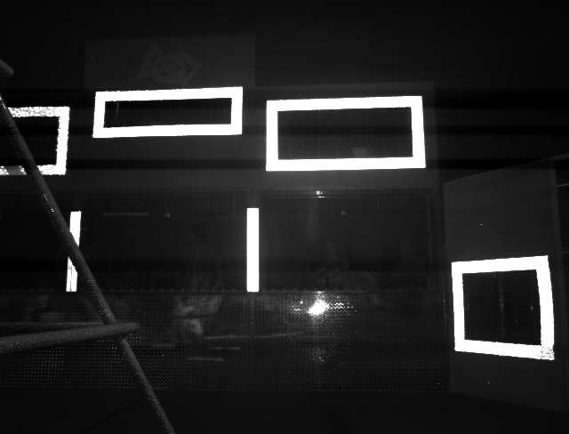
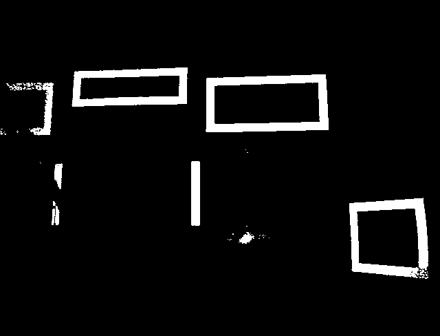
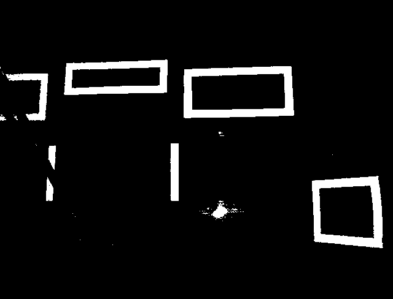
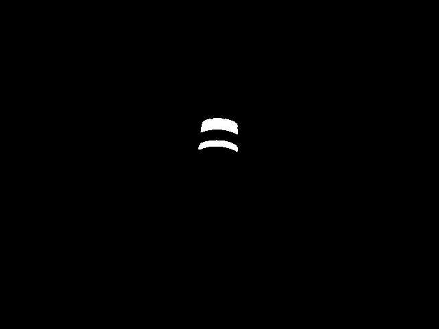

Thresholding
============

Thresholding is the process of converting an image to a binary image. If a pixel passes the threshold, it turns white (255 for 8 bit images), else, it turns black (0).

The rest of the page will talk about the various types of thresholding techniques OpenCV provides.

Threshold
---------

The "threshold" algorithm is defined mathematically as 

.. math:: 

    dst(x,y) =
    \begin{cases}
    maxValue & \text{if } src(x,y) > value \\
    0       & \text{if } src(x,y) <= value
    \end{cases}

In layman's terms, if :math:`low < pixel value` , then the pixel passes the test and is turned white, else it is turned black.

.. figure:: ../vision/media/threshold.png
    :width: 320px
    :align: center
    :height: 240px
    :alt: Erosion Example
    :figclass: align-center

.. tabs::

   .. code-tab:: java

       Imgproc.threshold(src, dst, value, maxValue, Imgproc.THRESH_OTSU);

   .. code-tab:: c++

       cv::threshold(src, dst, value, maxValue, THRESH_BINARY);

   .. code-tab:: py

       ret,dst = cv2.threshold(src, value, maxValue, cv2.THRESH_BINARY)

While other methods besides THRESH_BINARY exist in OpenCV, there is not a good application to use any of them in FRC.

Note that this is a high pass filter, and nothing more.

inRange
-------

OpenCV's "inRange" function checks if :math:`low < pixel value < high`, and if it is, then the pixel passes the test and is turned white, else it is turned black.

Note that this is identical to threshold's output because the parameters used made inRange behave the same. InRange is useful when thresholding for certain colors, as it is more than a simply high pass filter. 

.. tabs::

   .. code-tab:: java

       Core.inRange(src, low, high, dst);

   .. code-tab:: c++

       cv::inRange(src, low, high, dst);

   .. code-tab:: py

      ret, dst = cv2.inRange(src, low, high)

Otsu
----

Otsu thresholding is an old algorithm that is an adaptive thresholding technique. The algorithm assumes that the image contains two classes of pixels following a bi-modal histogram (foreground pixels and background pixels), it then calculates the optimum threshold separating the two classes so that their combined spread is minimal, or equivalently so that their inter-class variance is maximal.

Otsu's method exhaustively searches for the threshold that minimizes the intra-class variance, defined as a weighted sum of variances of the two classes:

:math:`\sigma _{w}^{2}(t)=\omega _{0}(t)\sigma _{0}^{2}(t)+\omega _{1}(t)\sigma _{1}^{2}(t)`

Weights :math:`\omega _{0}` and :math:`\omega _{1}` are the probabilities of the two classes separated by a threshold :math:`t` and :math:`{\displaystyle \sigma _{0}^{2}}` and :math:`{\displaystyle \sigma _{1}^{2}}` are variances of these two classes.

.. figure:: ../vision/media/otsu_demo.jpg
    :width: 450px
    :align: center
    :height: 320px
    :alt: Otsu Demo
    :figclass: align-center

.. tabs::

   .. code-tab:: java

       Imgproc.threshold(src, dst, 0, 255, Imgproc.THRESH_OTSU);

   .. code-tab:: c++

       cv::threshold(src, dst, 0, 255, CV_THRESH_BINARY | CV_THRESH_OTSU);

   .. code-tab:: py

       ret2, dst = cv2.threshold(src ,0 , 255, cv2.THRESH_OTSU)

Otsu thresholding optimizes the upper and lower bounds, so 0 and 255 are simply placeholders as OpenCV doesn't use a separate function for Otsu thresholding.

In a typical FRC game, your environment is not drastically changing, so it is best practice to use inRange with hand tuned values instead of Otsu for speed purposes.

Thresholding with Color Images
------------------------------

Up until now, the examples have been with grayscale images. Color images are different in the fact that they have 3 channels instead of one, meaning that threshold values must be provided for each channel (color). This is a very slow and tedious process. To make it easier, use this program: https://github.com/rr1706/Multi-Thresh. This utilizes sliders that dynamically changes the threshold values for each color, and also allows the user to tune HSV images as well. Always use inRange when thresholding RGB images

The syntax for each language changes slightly, as observed: 

.. tabs::

   .. code-tab:: java

       Core.inRange(src, new Scalar(low1, low2, low3), new Scalar(high1, high2, high3), dst);

   .. code-tab:: c++

       cv::inRange(src, Scalar(low1, low2, low3), Scalar(high1, high2, high3), dst);

   .. code-tab:: py

       dst = cv2.inRange(src, np.array([low1, low2, low3]), np.array([high1, high2, high3]))

Let's tackle an example. This is a pretty standard image that one might have if using green LEDs for the 2017 game. 

.. figure:: ../vision/media/boilerraw.jpg
    :width: 320px
    :align: center
    :height: 2400px
    :alt: Boiler Raw
    :figclass: align-center

The goal is to make the boiler tape white (255), and everything else black (0). By using the Multi-Thresh program, the RGB min and max values were found to be (0, 90, 0), (46, 255, 255), and they produce the following image:

If you find that you have noise, which is stray pixels, or if you thresholded away part of the inside of your target, please check out the morphological operations page.
